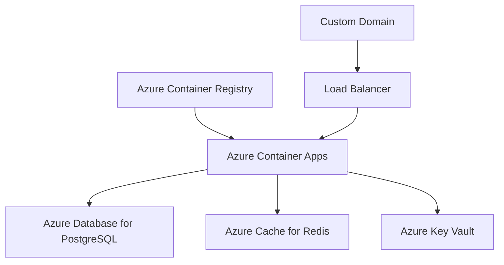

# 🚀 Azure Migration Guide - From Google Cloud to Azure

## 📋 Overview

This document outlines the complete migration from Google Cloud Platform to Microsoft Azure for the POEHR Scheduling application.

## 🔄 Migration Changes Summary

### 1. **Dependencies Changed**

**Removed Google Cloud Dependencies:**
```txt
❌ google-cloud-secret-manager==2.20.2
❌ cloud-sql-python-connector==1.18.3
```

**Added Azure Dependencies:**
```txt
✅ azure-keyvault-secrets==4.7.0
✅ azure-identity==1.15.0
✅ azure-core==1.29.5
```

### 2. **Settings Configuration**

**Google Cloud Settings (OLD):**
```python
# settings_production.py
PROJECT_ID = os.environ.get('GOOGLE_CLOUD_PROJECT', 'poehr-364520')
SECRET_KEY = get_secret('DJANGO_SECRET_KEY')
'HOST': f"/cloudsql/{PROJECT_ID}:us-central1:poehr-db-instance"
```

**Azure Settings (NEW):**
```python
# settings_azure.py
AZURE_SUBSCRIPTION_ID = os.environ.get('AZURE_SUBSCRIPTION_ID')
SECRET_KEY = get_azure_secret('django-secret-key')
'HOST': os.environ.get('DB_HOST', 'poehr-scheduling-postgres.postgres.database.azure.com')
```

### 3. **Secret Management**

**Google Secret Manager (OLD):**
```python
from google.cloud import secretmanager
def get_secret(secret_name):
    client = secretmanager.SecretManagerServiceClient()
    # ... Google-specific implementation
```

**Azure Key Vault (NEW):**
```python
from azure.keyvault.secrets import SecretClient
from azure.identity import DefaultAzureCredential
def get_azure_secret(secret_name):
    credential = DefaultAzureCredential()
    client = SecretClient(vault_url=vault_url, credential=credential)
    # ... Azure-specific implementation
```

### 4. **Database Connection**

**Google Cloud SQL (OLD):**
```python
DATABASES = {
    'default': {
        'HOST': f"/cloudsql/{PROJECT_ID}:us-central1:poehr-db-instance",
        # Unix socket connection
    }
}
```

**Azure Database for PostgreSQL (NEW):**
```python
DATABASES = {
    'default': {
        'HOST': 'poehr-scheduling-postgres.postgres.database.azure.com',
        'OPTIONS': {
            'sslmode': 'require',  # Azure requires SSL
        },
    }
}
```

### 5. **Redis Configuration**

**Google Memorystore (OLD):**
```python
CHANNEL_LAYERS = {
    'default': {
        'CONFIG': {
            "hosts": [(REDIS_HOST, 6379)],
        },
    },
}
```

**Azure Cache for Redis (NEW):**
```python
CHANNEL_LAYERS = {
    'default': {
        'CONFIG': {
            "hosts": [(REDIS_HOST, 6380)],  # Azure uses port 6380
            "password": REDIS_PASSWORD,
            "ssl": True,  # Azure requires SSL
        },
    },
}
```

### 6. **Environment Variables**

**Removed:**
- `GOOGLE_CLOUD_PROJECT`
- `CLOUD_SQL_CONNECTION_NAME`
- `K_SERVICE` (Cloud Run specific)

**Added:**
- `AZURE_SUBSCRIPTION_ID`
- `AZURE_RESOURCE_GROUP`
- `AZURE_KEYVAULT_NAME`
- `CONTAINER_APP_NAME` (Azure Container Apps specific)

### 7. **Deployment Configuration**

**Google Cloud Build (OLD):**
```yaml
# cloudbuild.yaml
steps:
  - name: 'gcr.io/cloud-builders/docker'
    args: ['build', '-t', 'gcr.io/$PROJECT_ID/poehr-scheduling', '.']
```

**Azure Container Registry (NEW):**
```bash
# deploy-azure.sh
az acr build \
    --registry "$ACR_NAME" \
    --image "poehr-scheduling:latest" \
    --file "Dockerfile.azure" \
    .
```

### 8. **Container Deployment**

**Google Cloud Run (OLD):**
```bash
gcloud run deploy poehr-scheduling \
    --image gcr.io/$PROJECT_ID/poehr-scheduling \
    --region us-central1 \
    --add-cloudsql-instances $PROJECT_ID:us-central1:poehr-db-instance
```

**Azure Container Apps (NEW):**
```bash
az containerapp create \
    --name "$CONTAINER_APP_NAME" \
    --environment "$CONTAINER_APP_ENV" \
    --image "$ACR_LOGIN_SERVER/poehr-scheduling:latest" \
    --target-port 8080 \
    --ingress external
```

## 🏗️ Azure Infrastructure

### Services Mapping

| Google Cloud Service | Azure Equivalent | Purpose |
|---------------------|------------------|---------|
| Cloud Run | Azure Container Apps | Serverless containers |
| Cloud SQL | Azure Database for PostgreSQL | Managed PostgreSQL |
| Memorystore | Azure Cache for Redis | Managed Redis |
| Secret Manager | Azure Key Vault | Secret management |
| Cloud Build | Azure Container Registry | Container building |
| Cloud Storage | Azure Blob Storage | File storage (optional) |

### Resource Architecture



## 🚀 Deployment Steps

### 1. Prerequisites
```bash
# Install Azure CLI
curl -sL https://aka.ms/InstallAzureCLIDeb | sudo bash

# Login to Azure
az login

# Set subscription
az account set --subscription "your-subscription-id"
```

### 2. Deploy Infrastructure
```bash
# Make deployment script executable
chmod +x deploy-azure.sh

# Update configuration in deploy-azure.sh
# - SUBSCRIPTION_ID
# - RESOURCE_GROUP
# - LOCATION
# - Service names

# Run deployment
./deploy-azure.sh
```

### 3. Update Secrets
```bash
# Update secrets in Azure Key Vault
az keyvault secret set --vault-name "poehr-scheduling-kv" --name "database-password" --value "your-secure-password"
az keyvault secret set --vault-name "poehr-scheduling-kv" --name "stripe-secret-key" --value "your-stripe-key"
# ... update other secrets
```

### 4. Configure DNS
```bash
# Get Container App URL
az containerapp show --name "poehr-scheduling" --resource-group "poehr-scheduling-rg" --query properties.configuration.ingress.fqdn

# Update your DNS to point to the Azure Container App URL
```

## 🔧 Configuration Files

### New Files Created:
- `Dockerfile.azure` - Azure-optimized Dockerfile
- `requirements.azure.txt` - Azure-specific dependencies
- `settings_azure.py` - Azure production settings
- `deploy-azure.sh` - Azure deployment script
- `startup-azure.sh` - Azure-specific startup script
- `verify_azure_deps.py` - Azure dependency verification
- `azure-container-app.yaml` - Container Apps configuration
- `.env.azure` - Azure environment template

### Modified Files:
- WebSocket configuration remains the same ✅
- Frontend configuration needs URL updates
- Database scripts work without changes ✅

## 🔍 Testing & Verification

### 1. Local Testing with Azure Services
```bash
# Copy Azure environment template
cp .env.azure .env

# Update .env with your Azure values
# Test locally with Azure services
python manage.py runserver --settings=poehr_scheduling_backend.settings_azure
```

### 2. Verify Azure Dependencies
```bash
python verify_azure_deps.py
```

### 3. Test WebSocket Connection
```javascript
// Test WebSocket after deployment
const wsUrl = 'wss://your-app-name.azurecontainerapps.io/ws/presence/?token=YOUR_JWT_TOKEN';
const ws = new WebSocket(wsUrl);
```

## 🎯 Benefits of Azure Migration

### Cost Benefits:
- 💰 **Pay-per-use pricing** in Container Apps
- 💰 **Flexible database tiers** in Azure Database
- 💰 **Free tier options** for development

### Technical Benefits:
- 🚀 **Better WebSocket support** in Container Apps
- 🔧 **Simplified deployment** with single service
- 📊 **Integrated monitoring** with Azure Monitor
- 🔐 **Enhanced security** with Key Vault
- 🌍 **Global availability** with Azure regions

### Operational Benefits:
- 🔄 **Easy scaling** with Container Apps
- 📈 **Built-in monitoring** and logging
- 🛡️ **Managed security updates**
- 🔧 **DevOps integration** with Azure DevOps

## 📋 Next Steps

1. **Review and update** configuration values in deploy-azure.sh
2. **Run the deployment** script to create Azure resources
3. **Update secrets** in Azure Key Vault with real values
4. **Test the deployment** and WebSocket functionality
5. **Configure custom domain** and SSL certificates
6. **Set up monitoring** and alerting
7. **Update frontend** environment variables
8. **Migrate DNS** from Google Cloud to Azure

## 🔗 Useful Links

- [Azure Container Apps Documentation](https://docs.microsoft.com/en-us/azure/container-apps/)
- [Azure Database for PostgreSQL](https://docs.microsoft.com/en-us/azure/postgresql/)
- [Azure Key Vault](https://docs.microsoft.com/en-us/azure/key-vault/)
- [Azure Cache for Redis](https://docs.microsoft.com/en-us/azure/azure-cache-for-redis/)
- [Azure CLI Reference](https://docs.microsoft.com/en-us/cli/azure/)
